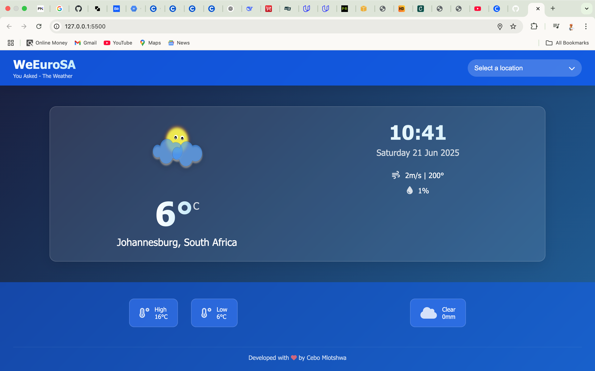

# 🌍 WeEuroSA ⛅ — *Weather Across Europe & South Africa*

> **WeEuroSA** is a visually dynamic, earth-themed weather application that offers real-time forecasts for cities across Europe and South Africa. Built for accessibility, reliability, and beauty — from Amsterdam to Cape Town.

 <!-- Replace with your actual screenshot -->

---

## ✨ Features

- 🌐 **Live Weather Data** – Powered by the 7Timer! API for 50+ cities
- 🇿🇦 **South African Cities Included** – Johannesburg, Cape Town, Durban, Pretoria, Bloemfontein & more
- 🕹️ **Dynamic Gradients** – Background colors shift with time of day and weather conditions
- 🗺️ **Geolocation Support** – Instantly detect your current location’s weather
- 📆 **7-Day Forecast** – Scrollable weather cards with max/min temperatures, cloud coverage, and precipitation
- ⚡ **Responsive** – Smoothly adapts to mobile and desktop screens
- 🎨 **Animated UI Elements** – Weather-themed icons and loading states

---

## 🔧 Technologies Used

- HTML5, CSS3, JavaScript (Vanilla JS)
- [7timer.info](http://www.7timer.info/) – Weather forecast API
- [Nominatim](https://nominatim.openstreetmap.org/) – Location reverse geocoding
- Font Awesome & Custom SVGs – Iconography
- OpenStreetMap – Location details

---

## 🚀 Installation

1. **Clone the repo**:
   ```bash
   git clone https://github.com/YungCopelCreatives/WeEuroSA.git 
Open the App:

Double-click index.html or open in your browser

No build tools required — it's a static frontend app

🌤️ Usage
Choose a location from the dropdown

Or grant browser location access to fetch your city’s weather

Scroll to see daily breakdowns and 7-day forecast visuals

📁 Folder Structure
css
Copy
Edit
WeEuroSA/
│
├── index.html
├── css/
│   └── master.css
├── js/
│   └── main.js
├── data/
│   └── city_coordinates.js
├── images/
│   ├── rain.svg, snow.svg, clear.svg, earth.gif ...
├── README.md
└── LICENSE
⚙️ Configuration
To add cities, update the city_coordinates.js file like this:

javascript
Copy
Edit
{
  latitude: "-29.8587",
  longitude: "31.0218",
  city: "Durban",
  country: "South Africa"
}
Note: You can convert a .csv city dataset to JSON using online tools like:
👉 https://csvjson.com/csv2json

🐛 Troubleshooting
Error: Unexpected token '}'... not valid JSON

Fix:

Ensure your JSON has no trailing commas or missing keys

Validate your file with https://jsonlint.com

Issue: Icons not loading?

Make sure your images/ folder has the matching filenames

Double-check file paths and case-sensitivity

🤝 Contributing
We welcome help to make WeEuroSA even better:

Fork this repo

Create a new branch (git checkout -b feature-name)

Commit your changes

Push the branch

Open a pull request

📜 License
Licensed under the MIT License – see the LICENSE file for details.

👏 Credits
Created by: Cebo Mlotshwa

Weather icons: Font Awesome, Custom SVGs

APIs: 7timer.info, Nominatim

Cities dataset includes Europe + South Africa

"WeEuroSA — A Forecast You Can Trust, From Amsterdam to Mzansi." 🌍

